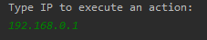
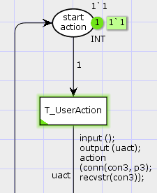
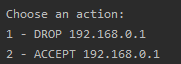
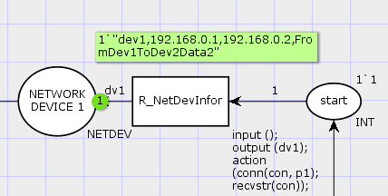
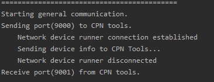
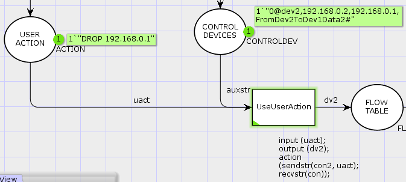

# sdn-coloredpetrinet-model
This model aims to represent the basic concept of software-defined networks using Color Petri networks.

## Prerequisites
- [CPN Tools](http://cpntools.org/)
- [Java](https://www.java.com/pt_BR/)

## Getting Started
First of all you will need to clone this repository using:
> $ git clone https://github.com/chrismachado/sdn-coloredpetrinet-model.git

### OS Setup
The tool **CPN Tools** only run correctly on Windows, so if you're using Linux OS's based, I recommend you to change for Windows with grub 
or on virtual machine.

### Develop Enviroment
I'm using the IntelliJ IDEA to run my Java classes. But, you can do this on command line if you want.

## SDN Scenario 
The core idea of an Software Defined Network is the divison of the data plane and the control plane. So, we have the idea of central a controller 
device, whereupon we can implements various high level applications. Thus, some benefits can be explored, such as the high programmability feature.
For this scenarios we've only implemented two features, DROP or ACCEPT some packet from IP source or IP destination, but you can implements more complex 
features with this base model.

## Running Scenario
To do this open file finalwork.cpn on _cpn/model/finalwork.cpn_. Something like [this](https://drive.google.com/file/d/176YVVT89E80Ha6WBVOV9UTu6ioPYaNH0/view?usp=sharing) should be the result when you've oppened.
Then you will need to start two Java classes, *RunnerMain* and *UserActionMain*.
After run UserActionMain you should give the IP address that will be used in your action like this then press Enter.

Then, you should execute the transition *T_UserAction*.

So, you now need to choose an action to do only by typing **1** or **2**.

After do this, this runner can be closed. Now, you will need to run RunnerMain and execute the transition *R_NetDevInfor*
 and so on with the others. These steps are very similar, so I won't replicate them.
 
 

Finally, if you've done all steps correctly, something like this should happen:

After that, you just need to activate the sequential transitions, and that is all.

## Author
- **Christiano Machado** @ christianomachado10@gmail.com

## Acknowledgments
- I'd like to thank *Corneli Gomes Furtado Júnior* for giving the opportunity to participate in the Hybrid Systems Modeling course.
